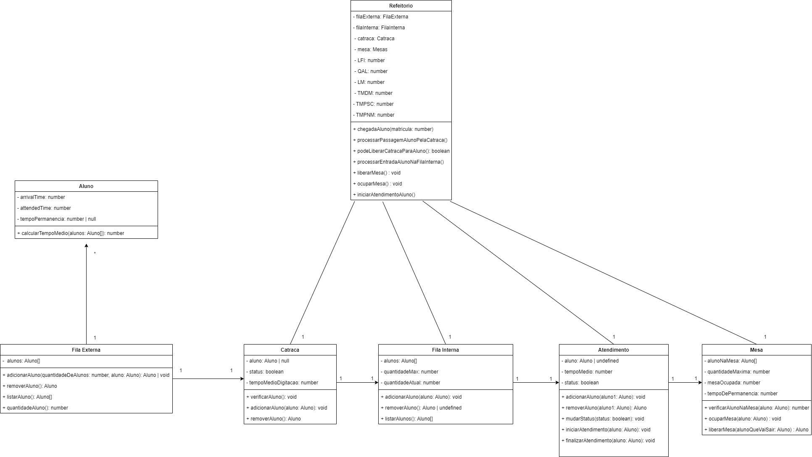

# Cafeteria Flow Simulator

A simulation project focused on understanding and improving the flow of people in a cafeteria. The main goal is to analyze the current process, identify bottlenecks, and propose improvements to enhance service quality and customer satisfaction.

## Project Overview

This simulator models the cafeteria workflow, providing insights into areas where efficiency can be improved. It helps visualize the movement of customers, wait times, and service bottlenecks through event-driven simulations.

## Features

- Simulates the flow of customers in a cafeteria
- Analyzes bottlenecks and service delays
- Provides insights for process optimization
- Event-driven architecture for realistic simulation

## System Diagrams

### System Flow Diagram
Illustrates the overall structure of the simulation, from customer entry to service completion.


### Event Diagram
Shows the sequence of events and interactions between customers and the system.



## Getting Started

### Prerequisites
Ensure you have Node.js and npm installed. You can install Node.js using [nvm](https://github.com/nvm-sh/nvm#installing-and-updating).

### Installation

1. Clone the repository:

   ```sh
   git clone <YOUR_GIT_URL>
   ```

2. Navigate to the project directory:

   ```sh
   cd <YOUR_PROJECT_NAME>
   ```

3. Install dependencies:

   ```sh
   npm i
   ```

4. Run the development server:

   ```sh
   npm run dev
   ```

## Technologies Used

This project is built using:

- Vite
- TypeScript
- React
- shadcn-ui
- Tailwind CSS

## Contributing

Contributions are welcome! Feel free to open issues or submit pull requests to improve the simulator.

## License

This project is licensed under the MIT License.

